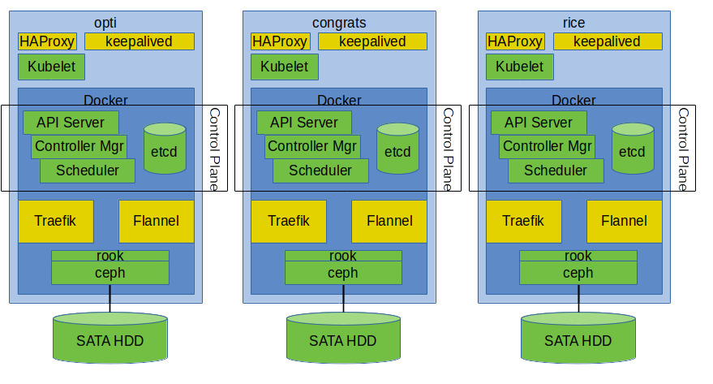

# Bare Metal Kubernetes on the Cheap
Last summer I found myself with an itch to gain a deeper understanding of how all the components in a typical kubernetes cluster work together. For me, the most natural way to gain that kind of understanding is to have an example of the machinery in question to build, take apart, and rebuild. A sensible person probably would have chosen a cloud vendor for this sort of adventure, but I've never been particularly sensible when faced with a desire to really learn anything. Since I'd been wanting a lab cluster for a while to support other odd hobbies, and really can't trust myself to tear a cloud cluster down and save myself from needing a second mortgage to pay off Amazon, I concluded that I'd build something at home.

My original plan was to get a refurbished desktop machine with a good pile of memory and set up a few VMs to support this adventure. However, two things scuppered this plan:
1. When I made my original purchase I didn't read very well - the Dell Optiplex I bought turned out to be a dual core machine - not really enough to support what I had in mind.
1. I wanted/needed to support stateful applications, both for my future workloads and to learn what was involved in supporting that sort of infrastructure.

This all lead me to the adventure at hand: building a kube cluster in my home lab on consumer-grade (i.e. cheap) hardware.

## Background
I'm assuming that this audience is at least somewhat familiar with Docker but not as familiar with Kubernetes, so I'm going to take a few minutes to give a quick overview of Kubernetes.

Kubernetes is a container orchestrator, meaning that it provides a set of tools to automate deployment, scaling, and management of containerized applications. It provides functionality to schedule workloads onto worker nodes in the cluster, detect when containers crash or exit and restart them if appropriate, establish networking between containers, connect them to distributed file storage, and a number of other handy tasks.

Kubernetes introduces a few new concepts in addition to the normal Docker world:

**Pod**
:  A Pod is the most basic unit of deployment in kubernetes. It encapsulates one or more containers with an IP address, a storage environment, and a set of configurations around those containers. Most of the other key abstractions in kubernetes provide ways of managing pods.

**Service**
:  A service defines a network access point exposed by a set of pods for other pods to consume. A service can expose one or more IP ports. The service is associated to the pods providing it by the use of a set of match rules. Typically these rules match to a label defined on the pod (often the 'app' label)

**Deployment**
:  A Deployment can be thought of as a declaritive template that can be used a number of pods. The Deployment allows us to manually scale the number of pods up and down (auto-scaling is handled by another abstraction).

**ReplicaSet**
:  A ReplicaSet controls a number of identical pods, defining the number of replicas. Often, a Deployment creates and manages a ReplicaSet under the covers

**StatefulSet**
:  A StatefulSet declares a number of identical pods, each of which has an identity that survives pod restarts. This allows us to assign individual storage to each of these long-lived pods and deploy stateful applications in kubernetes. My main needs here were to support kafka and cassandra (although a number of infrastructure components that I'm using for support also require state)

**DaemonSet**
:  A DaemonSet is used for cases where we want a single instance of a pod on each member of the kubernetes cluster. DaemonSets can be given match criteria to determine a subset of nodes to run on as well. We'll see a number of daemonsets today.

**Kubelet**
:  The kubelet daemon runs on all nodes in the cluster, managing the pods that are deployed on those nodes.

**Control Plane**
:  'Control plane' refers to the set of nodes that run the services that collaborate to manage the kubernetes cluster. These services include the API Server, the Controller Manager, and the Scheduler. The control plane uses etcd to store cluster metadata. The etcd cluster can be managed internally to the kubernetes cluster or externally.

## Goals
As I approached what passed for a design phase for this cluster, I kept a couple of high-level non-functional requirements in mind.
1. HA - I wanted my cluster to be 'HA-ish.' While I wasn't going to have redundant power or network and have no uptime goal, I did want the cluster to be what I've come to think of as 'maintenance tolerant,' meaning that I should be able to bring down any single node and have 'most' of the facilities remain available.
1. The cluster should employ features that are typically seen in production clusters. In particular, I wanted some redundancy in the control plane and the storage layer.

Those goals really lead in the same direction - the production features I wanted support HA.

## High level design
In order to accomplish those goals with a 'reasonable' investment in hardware, I decided to create a 3 node cluster where each node was a master, a worker, and a storage node.


In addition to the control plane components I mentioned above, this diagram also shows the storage and networking components. Starting from the bottom up, these are:
1. SATA hard disks - a single 4 TB spindle in each machine. Nice, cheap spinning rust.
1. The ceph distributed storage system, which provides configurably replicated storage.
1. The rook kubernetes operator for ceph, which integrates ceph into kubernetes in such a way that the ceph storage cluster can be managed within kubernetes. Between the two, rook and ceph allow automated provisioning of distributed storage for use by stateful sets in the kubernetes cluster
1. The flannel overlay network, allowing pod-to-pod traffic to be routed between nodes. Flannel provides a fairly simple vxlan overlay on the physical network.
1. The traefik reverse-proxy/load balancer, used as an 'ingress controller' by kubernetes. This allows clients outside the kubernetes cluster to access web applications running inside the cluster. Traefik also has integration with Let's Encrypt, providing simple management for SSL certificates for exposed applications.
1. HAProxy provides load balancing and failover outside the cluster
1. Keepalived allows an IP address to be shared between all three nodes. With HAProxy, this provides functionality similar to an F5 or ELB, decoupling external clients from physical machine IP addresses. This is critical in the failover between the API servers in the control plane.

Running on top of this core are a couple of additional peices of support infrastructure:
1. The 'ELK' stack for log aggregation and search - in this case 'ELK' is Elasticsearch, Kibana, and Filebeat (so, EFK?).
2. Prometheus and Grafana, for gathering of key performance and health indicators.

## Ansible
Ansible is a system for declaritive management of software installations. I've used it to automate the installation and initialization of the cluster so that it's repeatable. I've built the cluster at least 3 times now, thanks to this automation. It's far from perfect automation, as we'll see when we get into the procedures, but it does automate various fiddly parts of the build-out.

All the ansible (and kubernetes manifests) are available on [github](https://github.com/danch/cluster-ansible) 

## Hardware
The hardware I've built my cluster on is a bit of a grab-bag of what was economical at the time - a refurbished desktop, two or three generations of AMD processors and motherboards. The common theme (at least in terms of my intent) was 16GB or more of memory and the most cores I could get for under $500 per node. The emphasis on memory and cores has to do with my expected workloads - a number of memory intensive server processes (Kafka, Cassandra, Elasticsearch) and application loads that are highly parallel and compute intensive. Components are largely consumer grade, with the exception of the hard disks (because of the way Ceph works, disks need to be fast and support a surprisingly heavy duty cycle). Networking is 1Gb on a dedicated switch.

If I were to start over at this point, I'd settle on a single configuration, which would also include at least a small SSD for Ceph's write-ahead-log and indexes. An additional, larger SSD to provide a faster storage pool would also be interesting.

# Procedures
We're finally to the meat of the matter at hand - how to put this together and come out with a working, monitored kubernetes cluster? Most of the kubernetes set up has been derived from [Creating Highly Available Clusters with kubeadm](https://kubernetes.io/docs/setup/independent/high-availability/) This is neither the easy way (there are a good number of easier alternatives - see Docker Enterprise, kubespray, kops, GKE, EKS, AKS for example) nor [the hard way](https://github.com/kelseyhightower/kubernetes-the-hard-way). Kubeadm functionality for HA configurations is still experimental and is liable to change with every release (between 1.12 and 1.13, for example, it became quite a bit more automatic. I'm hopeful that this trend will continue).

Please note that the ansible I've pulled together is not intended to be a robust, general purpose cluster set up. It's simply the automation I wanted in order to get some level of repeatability to this process.

## Preparation
Prior to getting into the actual cluster initialization, the nodes need to have their baseline operating systems installed. I've run this procedure on both Centos 7.x (with kubernetes 1.12) and Ubuntu 18.10 (with kubernetes 1.13). You also need key-authenticated ssh (no password) from your workstation to all of the nodes. You may wish to set up passwordless sudo for the user you'll be using - I don't, but that requires an extra parameter when running ansible jobs. Make sure that you install python on the nodes, since that's a requirement for ansible.

Note that there's no requirement that the nodes be physical machines - a set of VMs would work fine for a walk-through.

Your workstation needs ansible and the kubectl ('kube control' often pronounced 'cube cuddle') kubernetes client installed.

## Define ansible inventory
For ansible to do it's thing, it needs to know about the machines it is controlling. This is done through an inventory file. This inventory file also allows us to categorize the hosts by their role in the cluster. In this case there are several roles expected by the ansible playbooks:
1. kube: All hosts in the cluster. This is mostly used so that host variables can be assigned in a sinble place in the inventory file.
1. kube-master: All masters in the cluster
1. worker: Any additional nodes that are not masters
1. proxy: Hosts running keepalived and haproxy
1. storage: Host for Ceph storage
1. vip: The virtual IP shared by the proxy hosts
1. zero-master: The first master to be initialized
1. other-master: The rest of the master group

If this seems excessive for a four member cluster, it probably is. The set of roles grew in a 
somewhat haphazard way as I added features to the ansible scripts. We'll go over the purpose of what is probably the most troubling set of them (three roles for the masters!?!) shortly.

Depending on the Linux distribution you're using, you may need to set the python interpreter to use as a global variable in your inventory, like so:
```
all:
  vars:
    ansible_python_interpreter: python3
```

## Create keepalived and haproxy configurations
The method used to configure keepalived and haproxy is to simply copy configuration files to each node verbatim. This could be templateized using ansible's built-in templating capability (Jinja2), but I simply haven't gotten around to it yet.

## Base Installation
The first step of the process is an ansible playbook that configures the target nodes and installes required and utility packages. This is run in the root of the repository with a command line like `ansible-playbook -i <inventory file> --ask-become-pass  kube-cluster.yml` (note that `--ask-become-password` is not needed if you've set up passwordless sudo).  Assuming that you have the nodes configured as discussed above, this will trundle through all the inventory and install the components and utilities required by the roles assigned to each node. 

The 'configuration' this playbook does involved things like setting firewall rules (N.B. it currently disables firewalld on CentOS!), disabling swap on all nodes, installing htop, atop, and iotop for troubleshooting, and ensuring that the smarttools package (for interacting with onboard HDD diagnostics) are on the storage nodes. Required software is kubelet, kubeadm, kubectl, and docker on all nodes and keepalived and haproxy on the proxy nodes.

## Initialize the first master
At this point, everything should be installed and ready to begin initializing the kubernetes cluster. Running `ansible-playbook -i <inventory file> --ask-become-pass kube-init-zero.yaml` is all it takes. This should trundle along for a few minutes, after which you should be able to ssh to your zero master and see the kubernetes family of daemon processes running at the top of your (h)top.

So, what this thing does is pretty simple: it runs `kubeadm init` with a configuration file that it copies to the host in question. That kubeadm configuration is pretty simple too: it just tells it what hostname to use in the certificate it generates and what CIDR to assign pod IPs from.

What `kubeadm init` does, on the other hand, is rather more involved. It generates a couple of certificates, one of which is used internally as a certificate authority root. It defines a set of static pods (pods that are run by the kubelet when it starts, with the metadata coming from a local file rather than from etcd) on the host. It configures the kubelet daemon to run on the base OS. The static pods include the kube API server, the kube controller, etcd, and the kube scheduler. kubeadm configures security in these pods, sets core configuration, and generally gets them into a state where they'll talk to each other.

Note that in this configuration etcd is running as a container, but its storage is volume mounted into that container. In other words, etcd's data storage is on the host it's running on. Really, it has to be, since it's basically at the beginning of the bootstrap foodchain. 

## Initialize other nodes
Now, we can take the next step and initialize kubenetes on the remaining nodes by running `ansible-playbook -i vm-inv.yml --ask-become-pass kube-init-other.yml`. Again, this will take a few minutes as docker images for the various daemons are pulled onto the nodes. Note that I have had this ansible script timeout waiting for the initialization to complete. This is an occasional issue, and retries generally succeed.

This script copies a bunch of files from the zeroth master to the local directory 'temp'. This includes private key material! This is just one of the many ways in which this setup is innappropriate for production use, but do clean up that directory when you're done! At any rate, once the files are copied to the local machine, they're copied out to each remaining master node and put under /etc/kubernetes so that they can form the base for the new master's configuration. Then `kube-init join --experimental-control-plane` is executed on the node. That flag, introduced in kubeadm 1.13, automates some rather fiddly manual steps that had been required.

Any worker nodes will also be pulled into the cluster, basically using the kube-init join command without the control plane flag.

## Initialize Rook/Ceph

